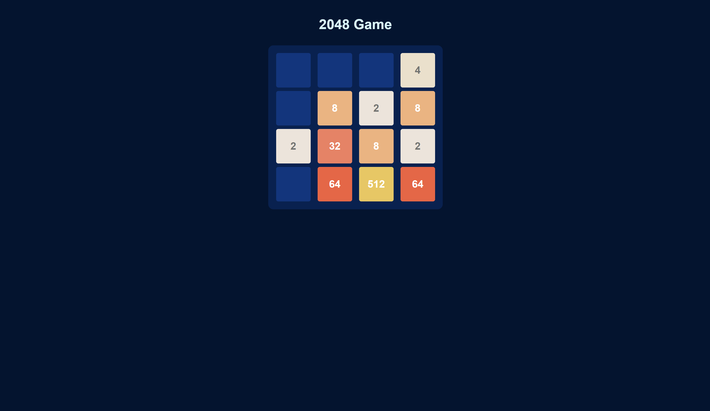
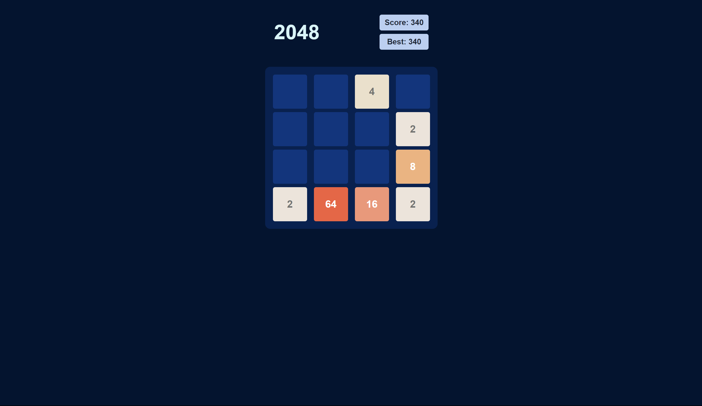
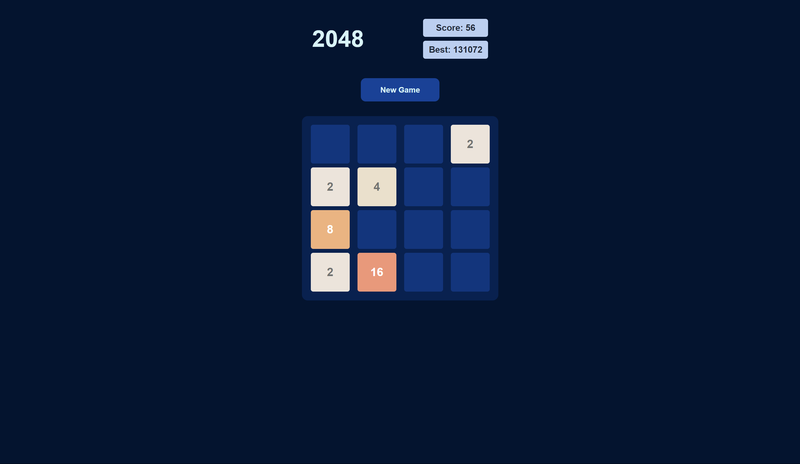
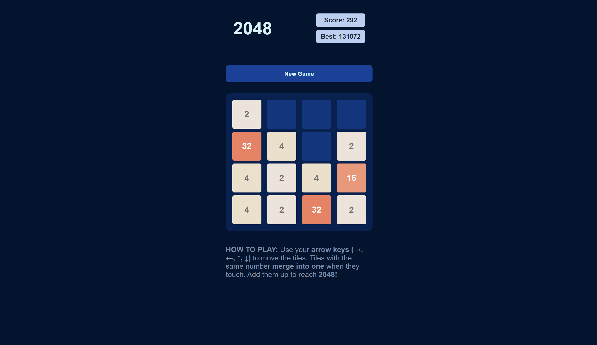
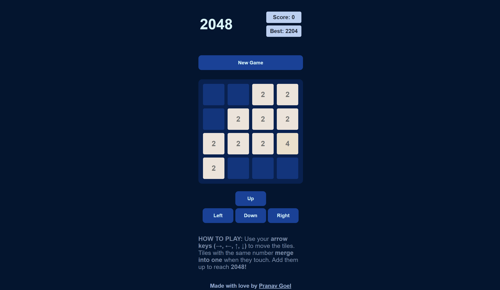
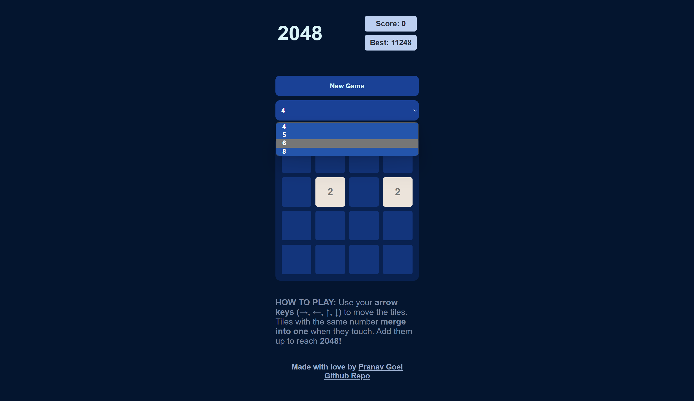
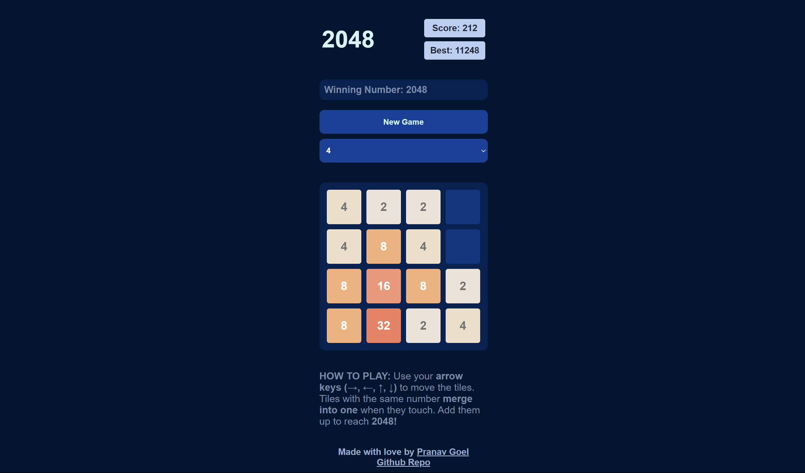

# 2048-Game

## Functions, components of the Game

- Initialize grid/matrix
- Swipes
  - Left
  - Right
  - Up
  - Down
- Check if → Game Over or Complete
  - Basically when no more moves are left (Not able to add numbers), e.g. → 2,4,8,2
- Reset if over

<br>
At First there will be two randomly placed 2s or 4s to start the game (Initial State)

    For Desktop we are using the arrow keys. →, ←, ↑, ↓

## 📦About Project

Tech Stack:

- React
- TypeScript
- Styled-Components (Add types, when using TS)
- Vite

Used 'lodash.clonedeep' for deep cloning the matrix.

<br>

### To change the Grid size and ending state, update the following in [Board.tsx](./src//Components/Board.tsx)

They are inside a enum `GameVariablesGrid`

```javascript
gridSize //Changes size of the grid
winningNumber  // Winning state/number of the Game
```

<br>

I am documenting how I progressed with the whole game development, attaching screenshots for reference.

<br>

<blockquote><b><i>Till this point we were able to have a initialization state of the game where we will either get two boxes with the random combination of 2 and 4.</i></b></blockquote>


<b>Generating 2D array just from Grid-Size to make it dynamic.</b>
&nbsp;


<blockquote><b><i>Adding Operation in one-direction, combined with swipe.</i></b></blockquote>


<br>

<blockquote><b><i>Seperated files/functions to make them easy to maintain. 😁
Added color for different numbers.</i></b></blockquote>



<br>


<blockquote><b><i>Added scores, tracking best and current score, using localStorage to persist the best scores and updating them.</i></b></blockquote>



<br>

<blockquote><b><i>Added new game button.</i></b></blockquote>



<br>

<b>Completed View! 🥳</b>




<br>

<blockquote><b><i>Added game control buttons for phones view.<i></b></blockquote>




<br>

<blockquote><b><i>Added a basic drop-down menu to change the size of the grid.<i></b></blockquote>




<br>


<blockquote><b><i>Incorporated the winning number of the game according to the size of the grid.<i></b></blockquote>

<p>It is a very basic implementation for now, will have to update it later to manage the updation of thing throughout the app as a whole to bring down the overall complexity.</p>




<br>


## Prerequisites

- Node.js (v14 or later)
- Yarn (v1.22 or later)

<br>

## Getting Started

1. Clone this repository to your local machine: 
```bash
git clone https://github.com/pranavgoel29/2048-Game
```


2. Navigate to the project's directory:
```bash
cd 2048-Game
```

3. Install dependencies using Yarn:
```bash
yarn install
```

<br>

## Running the App

To run the app in development mode, use the following command:
```bash
yarn dev
```

This command will start the Vite development server and compile your React app.

<br>


## Future Goals
- [ ] Add Controls for mobile. (Touch swipes)
- [ ] Add animations for the moves.
- [ ] Game lost and won status to show on the grid with translucent effect.
- [ ] Track moves taken by people to win a particular game. (This is just a thought)


This is in the works.

- [x] Making the size of the grid dynamic. (Take input from the player)
    
    - <b>Formula -></b> 2 <sup> (Grid Size/2) + 3</sup>


<br>

## 🐛Bug Reporting

Feel free to [open an issue](https://github.com/pranavgoel29/2048-Game/issues) on GitHub if you find any bug.
