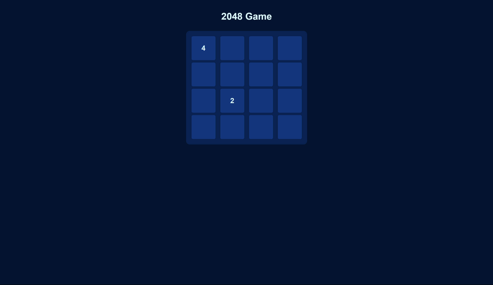

# 2048-Game

## Functions, components of the Game
- Initialize grid/matrix
- Swipes
    - Left
    - Right
    - Up
    - Down
- Check if → Game Over or Complete
    - Basically when no more moves are left (Not able to add numbers), e.g. → 2,4,8,2
- Reset if over

 
At First there will be two randomly placed 2s or 4s to start the game (Initial State)

    
    For Desktop we are using the arrow keys. →, ←, ↑, ↓

## 📦About Project

Tech Stack:
- React
- TypeScript
- Styled-Components (Add types, when using TS)
- Vite

 

I am trying to document how I progressed with the whole game development, attaching screenshots for reference.

 

## 🐛Bug Reporting

Feel free to [open an issue](https://github.com/pranavgoel29/2048-Game/issues) on GitHub if you find any bug.